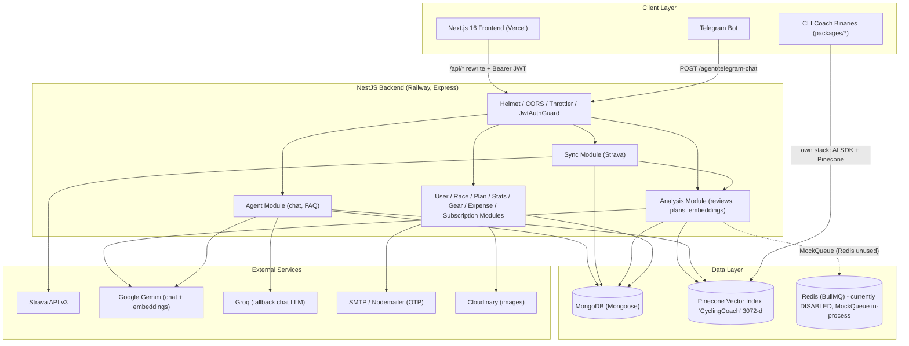
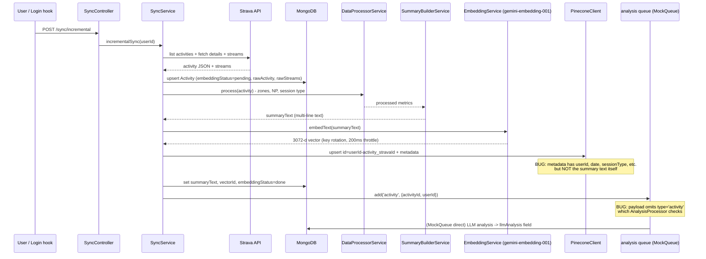
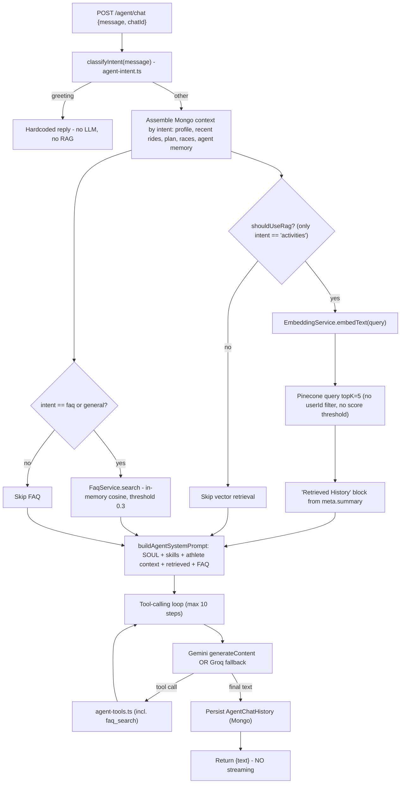
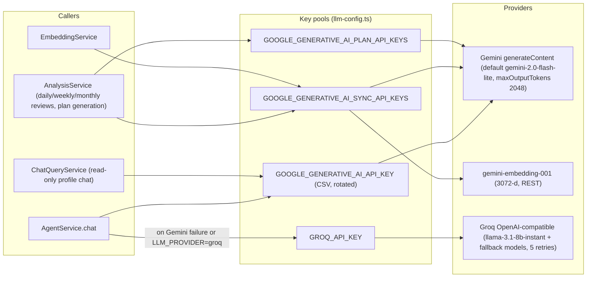
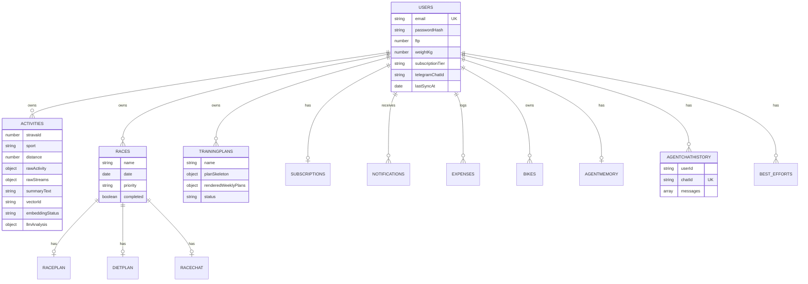
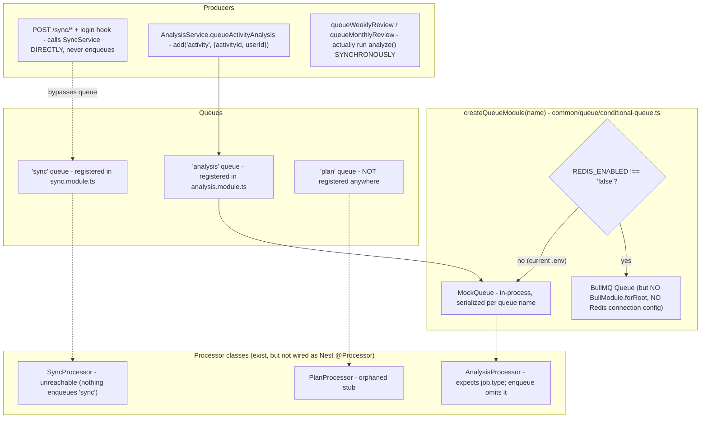

# Cycling Coach — System Architecture

> Generated from code analysis on 2026-07-26. Sources: `backend/src`, `frontend/`, `packages/`.

There are two parallel AI stacks in this repo:

1. **Web backend** (`backend/src`) — NestJS + MongoDB + Pinecone + Gemini/Groq. This is the production path used by the frontend.
2. **CLI coach** (`packages/core` + `packages/sport-*`) — Vercel AI SDK based agent binaries. Not consumed by the web app.

This document focuses on the web backend, with notes where the CLI stack differs.

---

## 1. High-Level System Overview

Key files:

- Entry: `backend/src/main.ts`, `backend/src/app.module.ts`
- Frontend API client: `frontend/lib/api.ts` (Bearer JWT from localStorage, `/api` rewrite in `frontend/next.config.ts`)

---

## 2. Data Ingestion and Vector Upsert Flow (Strava → Pinecone)

How an activity goes from Strava into MongoDB and Pinecone. Triggered by `POST /sync/*` or fire-and-forget after login — **runs in the HTTP request path today**, not in a worker.

Pipeline classes: `SyncService` → `ActivitySyncPipelineService.processActivity` → `DataProcessorService` / `SummaryBuilderService` / `EmbeddingService` / `PineconeClient` (all under `backend/src/analysis/`).

**FAQ ingestion (separate, not Pinecone):** on boot, `FaqService` loads `backend/data/faq-chunks.json`, embeds Q+A into memory, caches vectors to `backend/data/faq-embeddings.json`.

---

## 3. Query-Time RAG Chain (Agent Chat)

Key files: `backend/src/agent/agent.service.ts`, `agent-intent.ts`, `agent-system-prompt.ts`, `agent-athlete-context.ts`, `agent-tools.ts`, `faq.service.ts`.

A secondary RAG path exists in `backend/src/analysis/context-builder.service.ts` (`buildHistoricalContext`): reviews embed a synthetic query from current activities, query Pinecone top-5, and keep only matches that have `metadata.summary` — which the backend upsert never writes, so this is effectively empty.

---

## 4. LLM Call Routing

- All calls are **non-streaming** (`generateContent`, not `streamGenerateContent`).
- Key rotation and retry loops live in `common/llm-config.ts`, `common/groq-client.ts`, and `analysis/embedding.service.ts`.
- The CLI stack (`packages/core/src/llm.ts`) instead uses the Vercel AI SDK with Anthropic / OpenAI / Google / Codex.

---

## 5. Database (MongoDB via Mongoose)

No migrations; schemas are Mongoose `@Schema` classes. Main collections and relationships:

Also: `otps`, `segments`, `segment_efforts`, `best_efforts_sync_status`, `monthcontexts`, `weekcontexts`, `weeklyplans`, `modelchangerecommendations`, `paymentcards` (module not wired), `equipment`.

Explicit indexes are sparse: unique `users.email`, `subscriptions.user`, `agentchathistory {userId, chatId}`, and `notifications {user, createdAt}`. Activity queries by `{user, date}` have **no compound index**.

---

## 6. Redis / BullMQ — Current State (Mostly Scaffolding)

Reality check:

- **Redis is not used at runtime.** `.env` has `REDIS_ENABLED=false`, so every queue is a `MockQueue` running jobs in-process. `docker-compose.yml` starts `redis:7-alpine` but the app never reads `REDIS_HOST`/`REDIS_PORT`.
- If `REDIS_ENABLED=true` were set, jobs would enqueue to a default-localhost Redis with **no worker consuming them** (no `@Processor`/`WorkerHost` classes registered, no `BullModule.forRoot`).
- No retries, backoff, concurrency limits, dead-letter queue, or repeatable cron jobs are configured anywhere.
- Rate limiting (`ThrottlerModule`) is in-memory, not Redis-backed, so it does not survive restarts or scale across instances.

---

## 7. Environment Variables (Backend)

| Group | Variables |
| --- | --- |
| Core | `MONGODB_URI`, `PORT`, `CORS_ORIGIN`, `JWT_SECRET` |
| Queues | `REDIS_ENABLED` (no host/port vars read by code) |
| LLM (Google) | `GOOGLE_GENERATIVE_AI_API_KEY`, `GOOGLE_GENERATIVE_AI_SYNC_API_KEYS`, `GOOGLE_GENERATIVE_AI_PLAN_API_KEYS`, `GOOGLE_LLM_MODEL` |
| LLM (Groq) | `GROQ_API_KEY`, `GROQ_CHAT_MODEL`, `GROQ_FALLBACK_MODELS`, `LLM_PROVIDER` |
| Vectors | `PINECONE_API_KEY`, `PINECONE_HOST`, `PINECONE_INDEX`, `PINECONE_NAMESPACE` |
| Integrations | `STRAVA_*`, SMTP/`EMAIL_*`, `CLOUDINARY_*`, `STRIPE_SECRET_KEY`, `TELEGRAM_BOT_TOKEN`, `R2_*` (unused) |
