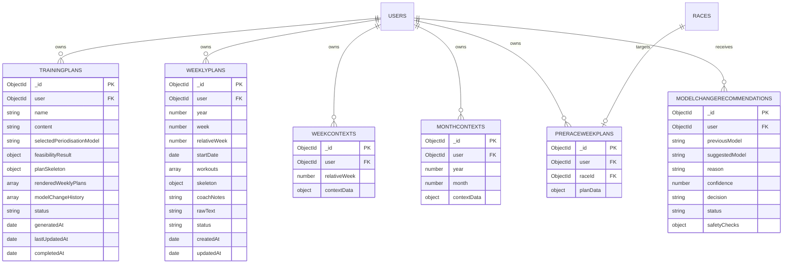
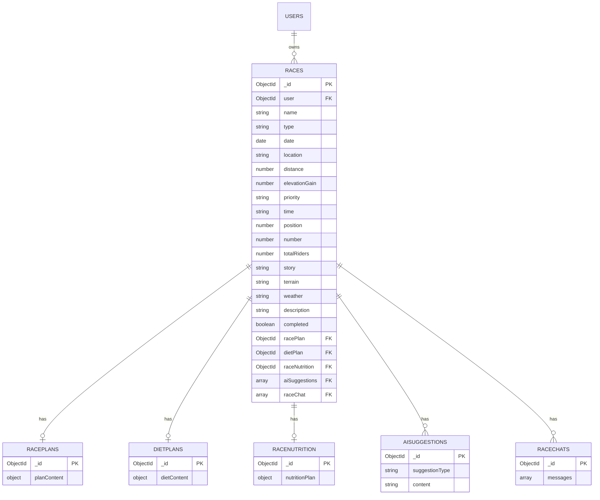
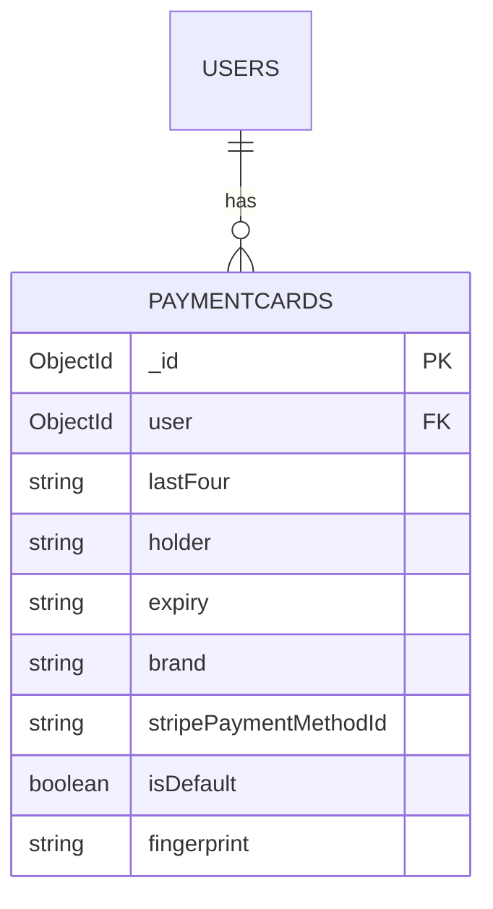
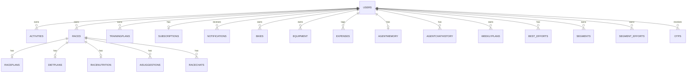

# Database Entity-Relationship Diagram

> Source: Mongoose schemas in `backend/src/**/*.schema.ts`. Database: **MongoDB** (no migrations).

---

## 1. Core Domain (User-Centric)

```mermaid
erDiagram
    USERS ||--o{ ACTIVITIES : owns
    USERS ||--o{ RACES : owns
    USERS ||--o{ TRAININGPLANS : owns
    USERS ||--o| SUBSCRIPTIONS : has
    USERS ||--o{ NOTIFICATIONS : receives
    USERS ||--o{ EXPENSES : logs
    USERS ||--o{ BIKES : owns
    USERS ||--o{ EQUIPMENT : owns
    USERS ||--o| AGENTMEMORY : has
    USERS ||--o{ AGENTCHATHISTORY : has
    USERS ||--o{ BEST_EFFORTS : has
    USERS ||--o{ SEGMENTS : owns
    USERS ||--o{ SEGMENT_EFFORTS : owns
    USERS ||--o| BEST_EFFORTS_SYNC_STATUS : has
    USERS ||--o{ WEEKLYPLANS : has
    USERS ||--o{ WEEKCONTEXTS : has
    USERS ||--o{ MONTHCONTEXTS : has
    USERS ||--o{ PAYMENTCARDS : has

    USERS {
        ObjectId _id PK
        string firstName
        string lastName
        string email UK
        string passwordHash
        string mainSport
        string experienceLevel
        number heightCm
        number weightKg
        string goal
        number cyclingYears
        number ftp
        number maxHeartrate
        number age
        string profileImage
        number totalDistance
        number totalMovingTime
        number totalElevation
        number totalCalories
        date lastSyncAt
        string subscriptionTier
        date subscriptionStartDate
        date subscriptionEndDate
        string stripeCustomerId
        string stripeSubscriptionId
        date stravaUpdatedAt
        boolean isStravaUpToDate
        string telegramChatId
        number weeklyGoalKm
        string selectedCoach
        boolean autoSyncEnabled
    }

    ACTIVITIES {
        ObjectId _id PK
        ObjectId user FK
        number stravaId
        string name
        string sport
        number distance
        number durationSeconds
        number elevationGain
        number calories
        number averageWatts
        number maxWatts
        number weightedAverageWatts
        number kilojoules
        number averageHeartrate
        number maxHeartrate
        boolean trainer
        date date
        boolean tracked
        object gear
        object rawActivity
        object rawStreams
        string polyline
        object processed
        string summaryText
        string vectorId
        string embeddingStatus
        object llmAnalysis
        date syncedAt
        date updatedAt
    }

    SUBSCRIPTIONS {
        ObjectId _id PK
        ObjectId user FK UK
        string tier
        date startDate
        date endDate
        string status
        string stripeCustomerId
        string stripeSubscriptionId
        boolean cancelAtPeriodEnd
        date trialEndDate
    }

    NOTIFICATIONS {
        ObjectId _id PK
        ObjectId user FK
        string type
        string title
        string message
        boolean read
        object metadata
        date createdAt
    }
```

---

## 2. Training & Planning



`WeeklyPlan.workouts` embeds `WorkoutDay` sub-documents: `dayOfWeek`, `type`, `distance`, `zoneBreakdown`, `terrain`, `completed`, `completedAt`.

---

## 3. Race Domain



---

## 4. Agent & Auth

```mermaid
erDiagram
    USERS ||--o| AGENTMEMORY : has
    USERS ||--o{ AGENTCHATHISTORY : has
    USERS ||--o{ OTPS : receives

    AGENTMEMORY {
        ObjectId _id PK
        ObjectId userId FK UK
        map sections
        array dailyNotes
        object currentPlan
        date updatedAt
    }

    AGENTCHATHISTORY {
        ObjectId _id PK
        ObjectId userId FK
        string chatId UK
        array messages
        date updatedAt
    }

    OTPS {
        ObjectId _id PK
        string email
        string code
        string type
        boolean used
        date expiresAt
    }
```

**Indexes:** `agentchathistory` unique compound `{userId, chatId}`; `users.email` unique; `agentmemory.userId` unique.

---

## 5. Gear, Expenses & Performance

```mermaid
erDiagram
    USERS ||--o{ BIKES : owns
    USERS ||--o{ EQUIPMENT : owns
    USERS ||--o{ EXPENSES : logs
    USERS ||--o{ BEST_EFFORTS : has
    USERS ||--o{ SEGMENTS : owns
    USERS ||--o{ SEGMENT_EFFORTS : owns
    USERS ||--o| BEST_EFFORTS_SYNC_STATUS : has

    BIKES {
        ObjectId _id PK
        ObjectId user FK
        string name
        string stravaId
        date dateAdded
        number distanceUsed
        boolean isActive
    }

    EQUIPMENT {
        ObjectId _id PK
        ObjectId user FK
        string name
        string type
        date dateAdded
        string notes
        string brand
        string equipmentModel
        number weightG
        date purchaseDate
    }

    EXPENSES {
        ObjectId _id PK
        ObjectId user FK
        date date
        string itemName
        number quantity
        number cost
    }

    BEST_EFFORTS {
        ObjectId _id PK
        ObjectId user FK
        string label
        number time
        number distance
        number avgSpeed
        string date
        string activityName
        string activityId
        number rank
        string category
        number previousBest
        boolean isFresh
    }

    SEGMENTS {
        ObjectId _id PK
        ObjectId user FK
        number stravaId UK
        string name
        number distance
        number elevationGain
        string city
        string state
        string country
        boolean hazardous
    }

    SEGMENT_EFFORTS {
        ObjectId _id PK
        ObjectId user FK
        number stravaId UK
        number segmentStravaId
        string name
        number elapsedTime
        number movingTime
        string startDate
        number distance
        number komRank
        number prRank
        boolean isKom
        boolean isPr
        string activityId
        string activityName
        string segmentName
    }

    BEST_EFFORTS_SYNC_STATUS {
        ObjectId _id PK
        ObjectId user FK UK
        string status
        date lastSyncAt
        string error
        boolean hasNewData
    }
```

---

## 6. Payments (Module Not Wired)



`PaymentCardsModule` and `StripeModule` exist in code but are **not imported** in `AppModule`.

---

## 7. Full System Overview



---

## External Vector Store (Not MongoDB)

Activities also have vectors in **Pinecone** (not a Mongo collection):

| Field | Location | Purpose |
| --- | --- | --- |
| `vectorId` | `Activity.vectorId` | Pinecone ID: `{userId}-activity_{stravaId}` |
| `summaryText` | `Activity.summaryText` | Source text that was embedded |
| `embeddingStatus` | `Activity.embeddingStatus` | `pending` / `done` / `failed` |
| Vector + metadata | Pinecone index `CyclingCoach` | 3072-d `gemini-embedding-001` embeddings |

---

## Index Summary

| Collection | Index | Type |
| --- | --- | --- |
| `users` | `email` | unique |
| `subscriptions` | `user` | unique |
| `agentchathistory` | `{userId, chatId}` | unique compound |
| `agentmemory` | `userId` | unique |
| `notifications` | `user` | single |
| `notifications` | `{user, createdAt}` | compound |
| `segments` | `stravaId` | unique |
| `segment_efforts` | `stravaId` | unique |
| `best_efforts_sync_status` | `user` | unique |

**Missing recommended indexes:** `{user, date}` on `activities`, `{user, stravaId}` on `activities`.

---

## Schema File Map

| Collection | Schema file |
| --- | --- |
| `users` | `user/user.schema.ts` |
| `activities` | `activity/activity.schema.ts` |
| `otps` | `auth/auth.schema.ts` |
| `subscriptions` | `subscription/subscription.schema.ts` |
| `notifications` | `notification/notification.schema.ts` |
| `races` + race sub-docs | `race/*.schema.ts` |
| `trainingplans` | `plan/plan.schema.ts` |
| `modelchangerecommendations` | `plan/model-change.schema.ts` |
| `weeklyplans` | `training-context/weekly-plan.schema.ts` |
| `weekcontexts` | `training-context/week-context.schema.ts` |
| `monthcontexts` | `training-context/month-context.schema.ts` |
| `preraceweekplans` | `training-context/pre-race-week-plan.schema.ts` |
| `bikes`, `equipment` | `gear/gear.schema.ts` |
| `expenses` | `expense/expense.schema.ts` |
| `agentmemory` | `agent/agent-memory.schema.ts` |
| `agentchathistory` | `agent/agent-chat-history.schema.ts` |
| `best_efforts`, `segments`, `segment_efforts`, `best_efforts_sync_status` | `best-efforts/best-efforts.schema.ts` |
| `paymentcards` | `payment-cards/payment-card.schema.ts` |
