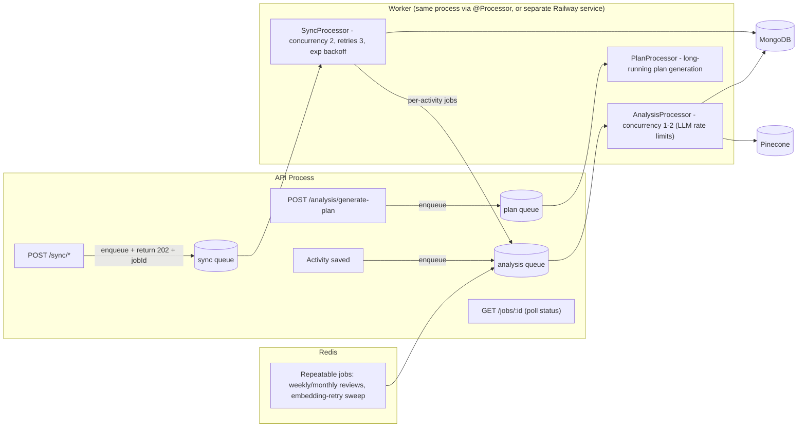

# Limitations and Improvement Brainstorm

> Companion to `ARCHITECTURE.md`. Findings from code analysis on 2026-07-26.
> Ordered by severity within each section. Each item names the file(s) involved so we can act on it directly.

---

## A. Critical bugs (broken behavior today)

### A1. Pinecone metadata never contains the summary text — RAG retrieval is effectively empty
- **Where:** `backend/src/analysis/activity-sync-pipeline.service.ts` (upsert) vs `backend/src/agent/agent.service.ts` (`retrieveContext`) and `backend/src/analysis/context-builder.service.ts` (`buildHistoricalContext`).
- **Problem:** the upsert writes `{userId, activityId, sportType, date, sessionType, ...}` but **not** `summary`. Both retrieval paths read `meta.summary`. So even when vectors match, the "Retrieved History" block is empty and the review historical context filters everything out.
- **Fix:** include `summary: summaryText` in upsert metadata (Pinecone metadata limit is 40KB per vector — summaries fit easily). Write a **backfill script** that re-upserts metadata for existing vectors (Mongo already has `summaryText` + `vectorId`, so no re-embedding needed — Pinecone supports metadata-only `update`).

### A2. Pinecone queries have no `userId` filter — cross-user data leakage
- **Where:** `agent.service.ts` `retrieveContext`, `context-builder.service.ts`.
- **Problem:** query is `topK=5` over the whole namespace. User A's chat can retrieve User B's ride summaries.
- **Fix:** add `filter: { userId: { $eq: userId } }` to every query. Metadata already contains `userId`, so this works immediately.

### A3. Analysis job payload omits `type` that the processor checks
- **Where:** `AnalysisService.queueActivityAnalysis` adds `{activityId, userId}`; `AnalysisProcessor.process` branches on `job.data.type === 'activity'`.
- **Fix:** one-line payload fix (`type: 'activity'`), or branch on job **name** instead of a data field.

### A4. Failed embeddings can produce garbage vectors
- **Where:** `embedding.service.ts` returns `[]` on 429/errors and the pipeline can still proceed.
- **Fix:** throw on empty embedding; set `embeddingStatus='failed'` and let a retry job pick it up later.

---

## B. Queue / async architecture (Redis + BullMQ)

Current state: BullMQ is scaffolding. `REDIS_ENABLED=false` → `MockQueue` runs jobs in-process; with it `true`, jobs go to Redis but **nothing consumes them** (no `BullModule.forRoot`, no `@Processor` workers). Heavy work (Strava sync, LLM analysis, plan generation) runs inside HTTP requests or as fire-and-forget promises.

### Target architecture

Concrete steps:

1. **Wire the connection:** `BullModule.forRoot({ connection: { host: REDIS_HOST, port: REDIS_PORT } })` in `AppModule` (or a `QueueModule`), read from env, keep `REDIS_ENABLED=false` → MockQueue fallback for local dev without Docker.
2. **Real workers:** convert `SyncProcessor`, `AnalysisProcessor`, `PlanProcessor` to `@Processor('name') extends WorkerHost`. Register `PlanProcessor` (currently orphaned).
3. **Move work off the request path:** `POST /sync/*` should enqueue and return `202 { jobId }`; frontend polls a small `GET /jobs/:id` endpoint (BullMQ `Queue.getJob`) or we add a notification on completion. Same for plan generation (currently a long LLM call in-request).
4. **Job hygiene:** `attempts: 3`, exponential backoff, `removeOnComplete`, `removeOnFail: { count: N }` for a poor-man's DLQ, per-queue concurrency tuned to LLM rate limits.
5. **Repeatable jobs:** weekly/monthly reviews as cron-repeatable jobs instead of the current misnamed synchronous `queueWeeklyReview`; a periodic sweep that retries `embeddingStatus='failed'` activities.
6. **Deployment:** either run workers in the API process (simplest, fine at current scale) or add a second Railway service running only workers.

### Other Redis opportunities (beyond BullMQ)
- **Redis-backed throttler** (`@nestjs/throttler` storage) so rate limits survive restarts / multiple instances.
- **Cache layer:** embedding cache for repeated agent queries; short-TTL cache for expensive stats endpoints.
- **Chat session state** if we ever scale beyond one instance.

---

## C. RAG quality improvements

1. **Expand RAG gating** (`agent-intent.ts` `shouldUseRag`): today only `intent === 'activities'` retrieves. Plans, zones, race prep, and general coaching questions would all benefit from historical ride context. Options: allow-list more intents, or always retrieve and let a score threshold decide inclusion.
2. **Score threshold:** FAQ search has a 0.3 cosine cutoff; activity RAG has none — low-relevance matches get injected into the prompt. Add a minimum score (tune empirically, e.g. 0.5+).
3. **Metadata filtering as pre-filter:** we already store `sportType`, `sessionType`, `date`, `hasPower`. Use them (e.g. date-range filters for "how did my last month look?", session-type filters for interval questions).
4. **Richer embedded documents:** the CLI stack (`packages/core/src/embeddings/sync.ts`) embeds a summary that includes an LLM coach narrative; the backend embeds only the deterministic summary. Consider embedding `summaryText + llmAnalysis` (re-upsert after analysis completes — a natural BullMQ job).
5. **Hybrid retrieval / reranking (later):** Pinecone supports sparse-dense hybrid; or rerank top-20 → top-5 with a cheap LLM call. Only worth it after A1/A2 land and we can measure quality.
6. **Streaming responses:** agent chat is a single JSON round-trip (`PaceBotChat.jsx` → `POST /agent/chat`). Gemini supports `streamGenerateContent`; NestJS can SSE. Big perceived-latency win for long coaching answers.
7. **Eval harness:** no way to measure retrieval quality today. Even a small script with 20 canned questions + expected activity IDs would let us tune topK/threshold safely.
8. **Config cleanup:** `embeddingModel: text-embedding-004` in packages config is dead (code hardcodes `gemini-embedding-001`); make the model configurable in one place, since changing dimensions requires a new Pinecone index.

---

## D. Backend / database hardening

1. **Mongo indexes:** add `{user: 1, date: -1}` on activities (dashboard + context queries), `{user: 1, stravaId: 1}` (sync dedupe), and review race/plan query patterns.
2. **`rawStreams` / `rawActivity` bloat:** full Strava streams stored on every activity document. Consider a separate collection or object storage (`R2_*` env vars exist but the S3 client is unused), and project them out of list queries.
3. **Auth hardening:** `@UserId()` falls back to the `X-User-Id` header; ensure it can never override the JWT-derived ID on authenticated routes.
4. **Strava credentials are global** (env / `~/.cycling-coach/config.yaml`), not per-user — blocking real multi-tenancy. Store per-user OAuth tokens (the `strava-auth` module already has a `store-tokens` flow; finish wiring it into `SyncService`).
5. **Dead/unwired code:** `PaymentCardsModule` + `StripeModule` not imported in `AppModule`; `@aws-sdk/client-s3` unused; `.env.example` far behind actual required vars. Decide: wire up or delete.
6. **Mongoose `retryAttempts: 1`** and no migration story — fine for now, worth revisiting before scale.

---

## E. Suggested priority order

| Phase | Items | Effort | Impact |
| --- | --- | --- | --- |
| 1. RAG correctness | A1 (metadata summary + backfill), A2 (userId filter), A4 (embed failure handling), C2 (score threshold) | Small | Very high — RAG actually starts working, leak closed |
| 2. Real async pipeline | B1–B6 (BullMQ forRoot, workers, 202+poll, retries, repeatables), A3 (payload fix) | Medium | High — sync/analysis off request path, reliable retries |
| 3. RAG quality | C1 (wider gating), C3 (metadata filters), C4 (richer docs), C6 (streaming) | Medium | High UX/quality |
| 4. Hardening | D1–D5, C7 (evals), C8 (config) | Small–Medium | Medium — scale and safety |

Open questions to decide before/while implementing:

- Do workers run in the API process or a separate Railway service? (Recommend: same process now, split later.)
- Frontend job-status UX: polling endpoint vs the existing notifications collection?
- Should the web backend eventually adopt `packages/core` instead of maintaining a parallel agent stack? (Bigger refactor — park for now, but stop letting the two diverge further.)
