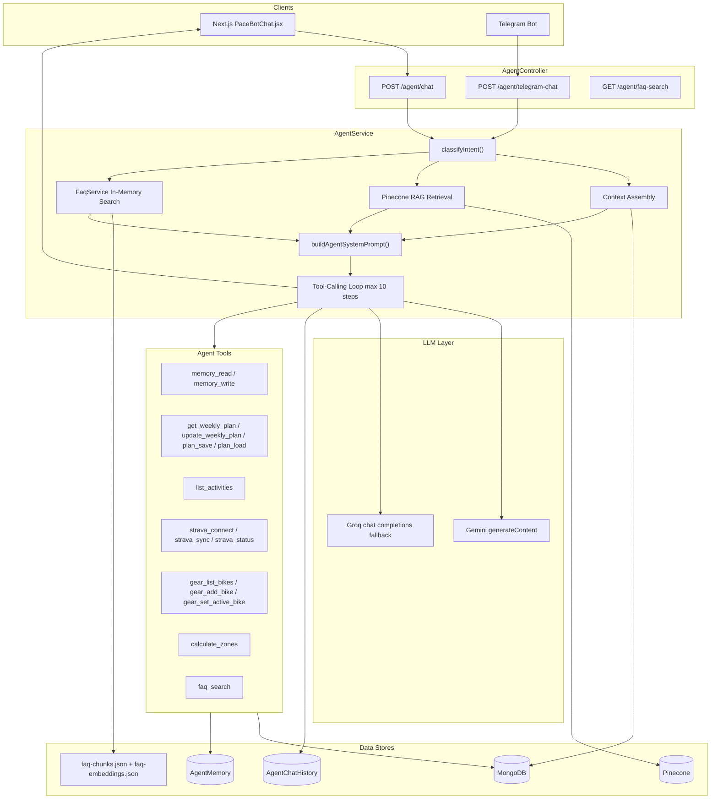
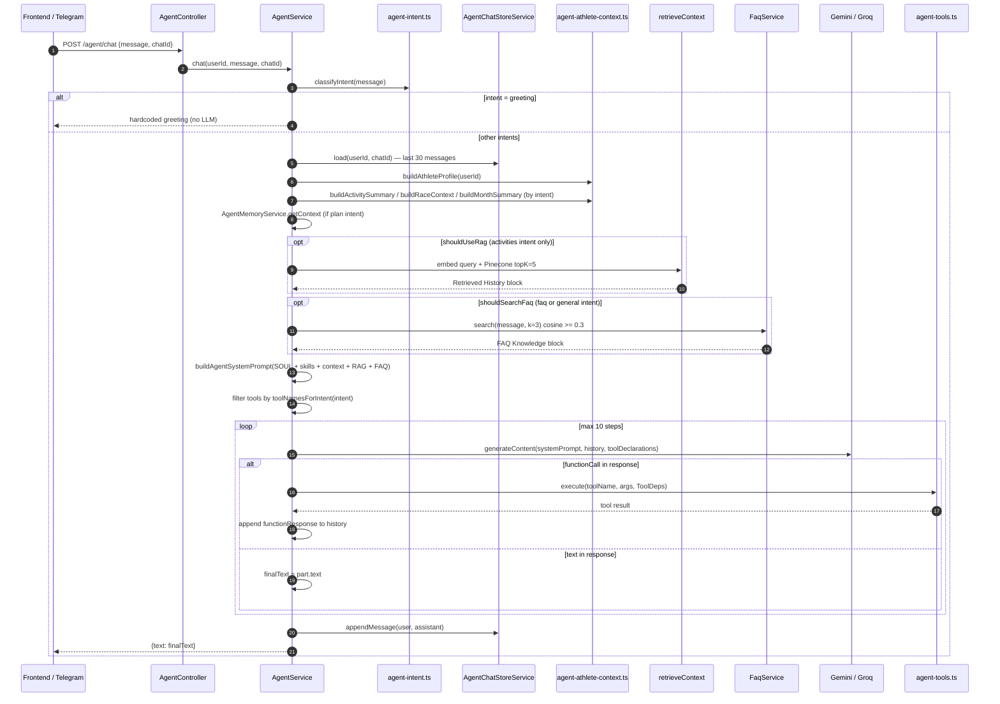
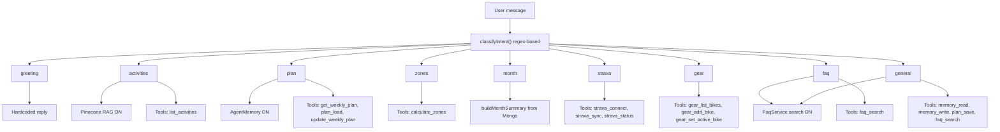
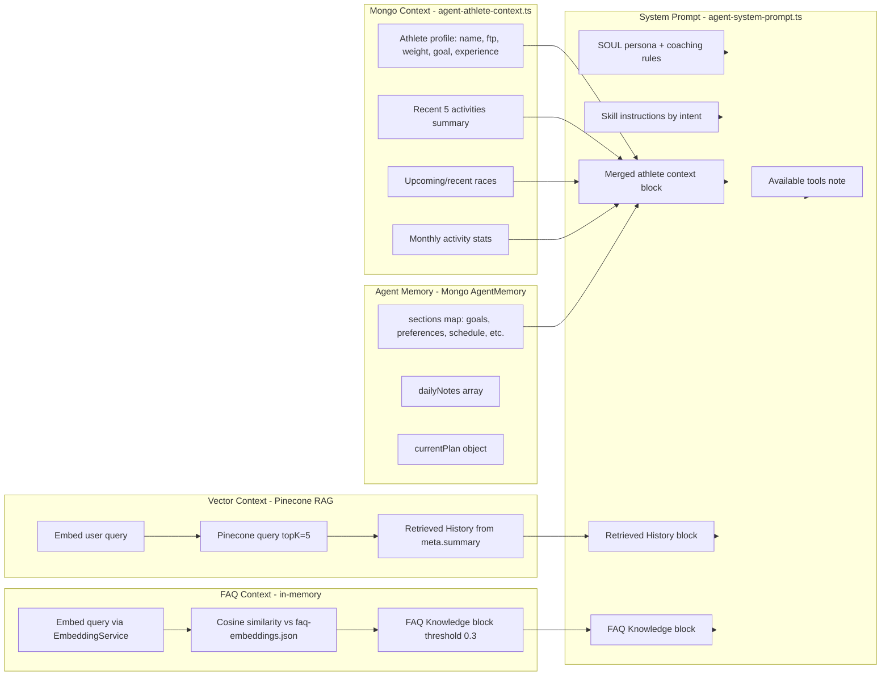
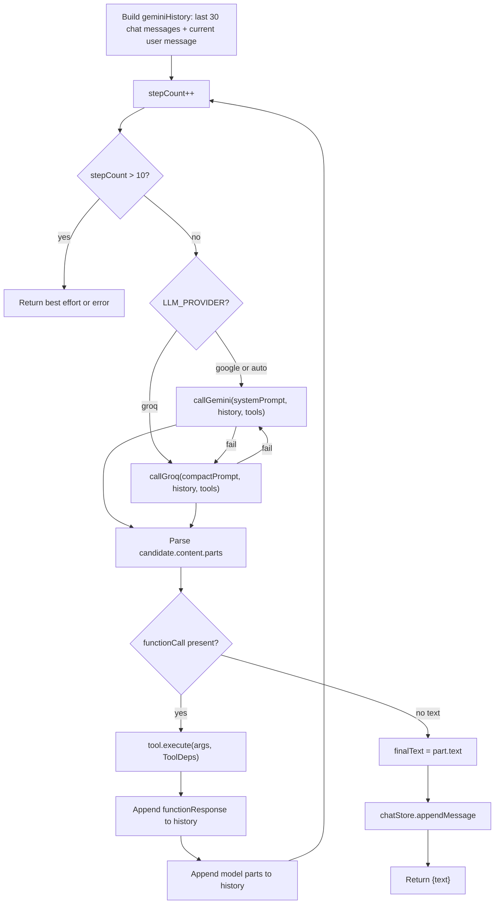
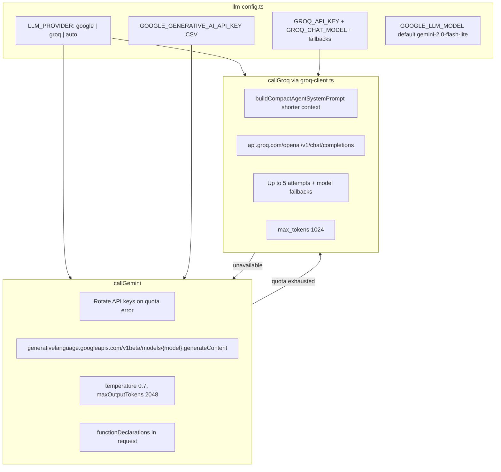
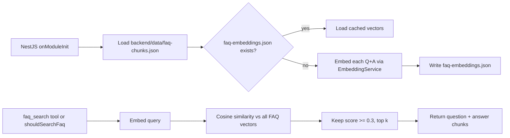
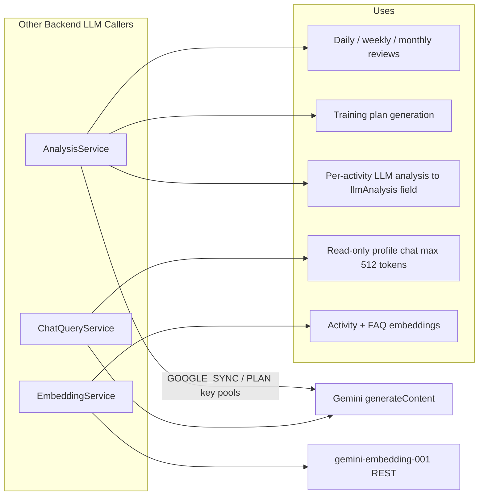

# LLM Agent Architecture

> Sources: `backend/src/agent/`, `backend/src/common/llm-config.ts`, `backend/src/common/groq-client.ts`

Architecture of the web backend coaching agent (`AgentService`). Handles chat from the frontend (`POST /agent/chat`) and Telegram (`POST /agent/telegram-chat`). All responses are **non-streaming** JSON `{ text }`.

---

## 1. High-Level Agent Architecture

Key files: `agent.controller.ts`, `agent.service.ts`, `agent-tools.ts`, `agent-system-prompt.ts`, `agent-intent.ts`, `agent-athlete-context.ts`.

---

## 2. Chat Request Flow

---

## 3. Intent Classification & Routing

| Intent | RAG (Pinecone) | FAQ search | Agent memory | Primary tools |
| --- | --- | --- | --- | --- |
| `greeting` | — | — | — | none |
| `activities` | yes | — | — | `list_activities` |
| `plan` | — | — | yes | `get_weekly_plan`, `plan_load`, `update_weekly_plan` |
| `zones` | — | — | — | `calculate_zones` |
| `month` | — | — | — | none (Mongo context only) |
| `strava` | — | — | — | `strava_connect`, `strava_sync`, `strava_status` |
| `gear` | — | — | — | `gear_list_bikes`, `gear_add_bike`, `gear_set_active_bike` |
| `faq` | — | yes | — | `faq_search` |
| `general` | — | yes | — | `memory_read`, `memory_write`, `plan_save`, `faq_search` |

Source: `agent-intent.ts`.

---

## 4. Context Assembly

---

## 5. Tool-Calling Loop

**ToolDeps** injects per-user access to: `AgentMemoryService`, `TrainingContextService`, `Activity` model, `User` model, `Bike`/`Equipment` models, `FaqService`.

---

## 6. LLM Provider Routing

---

## 7. FAQ RAG (Separate from Activity RAG)

FAQ is **not stored in Pinecone** — it lives in memory with a local disk cache.

---

## 8. Related LLM Callers (Outside Agent)

These share `llm-config.ts` key pools but are **not** part of the agent tool loop.

---

## Known Limitations

| Issue | Impact |
| --- | --- |
| RAG only for `activities` intent | Plans/zones/general miss historical ride context |
| Pinecone metadata lacks `summary` | Retrieved History block is often empty |
| No `userId` filter on Pinecone query | Cross-user retrieval risk |
| No streaming | High perceived latency on long answers |
| No reranking or score threshold on activity RAG | Low-quality matches injected into prompt |
| Regex intent classification | Miscategorization on ambiguous messages |

See [IMPROVEMENTS-BRAINSTORM.md](./IMPROVEMENTS-BRAINSTORM.md) for the prioritized fix plan.
