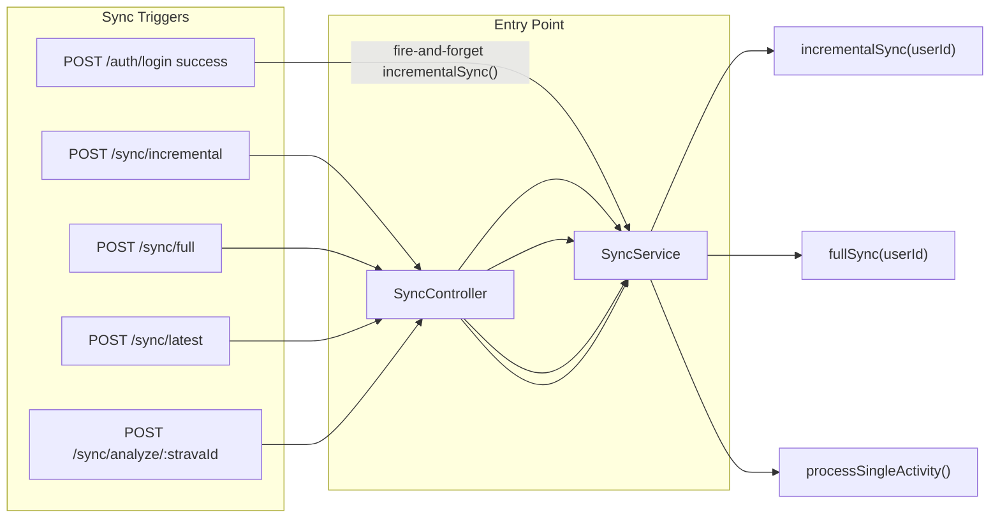
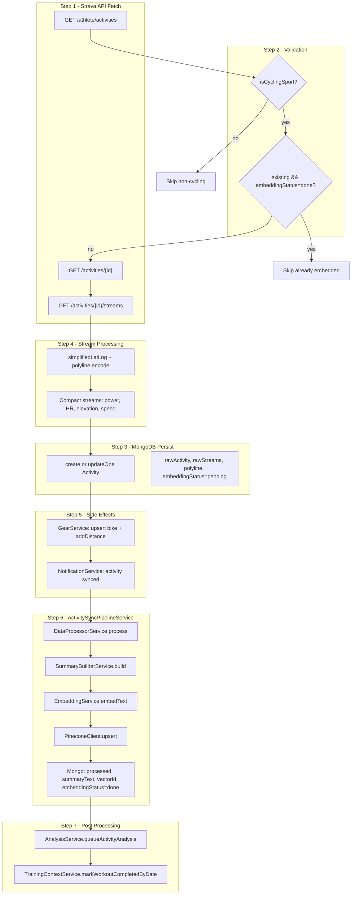
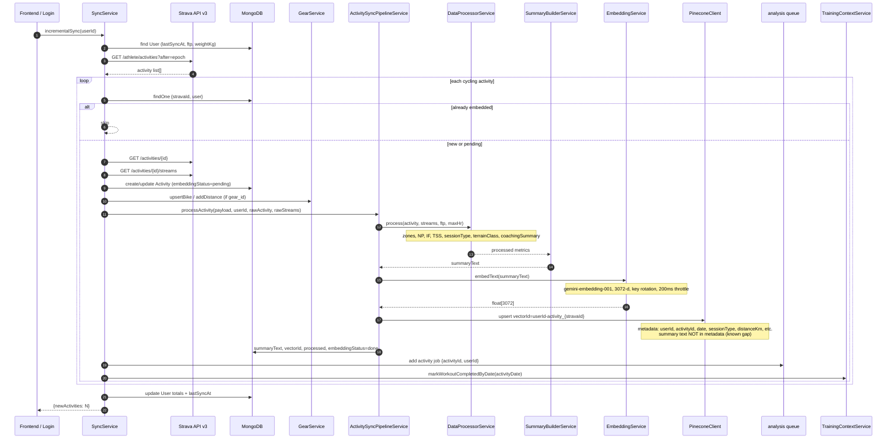
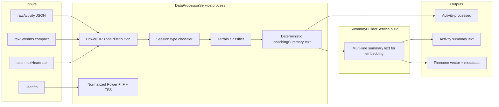
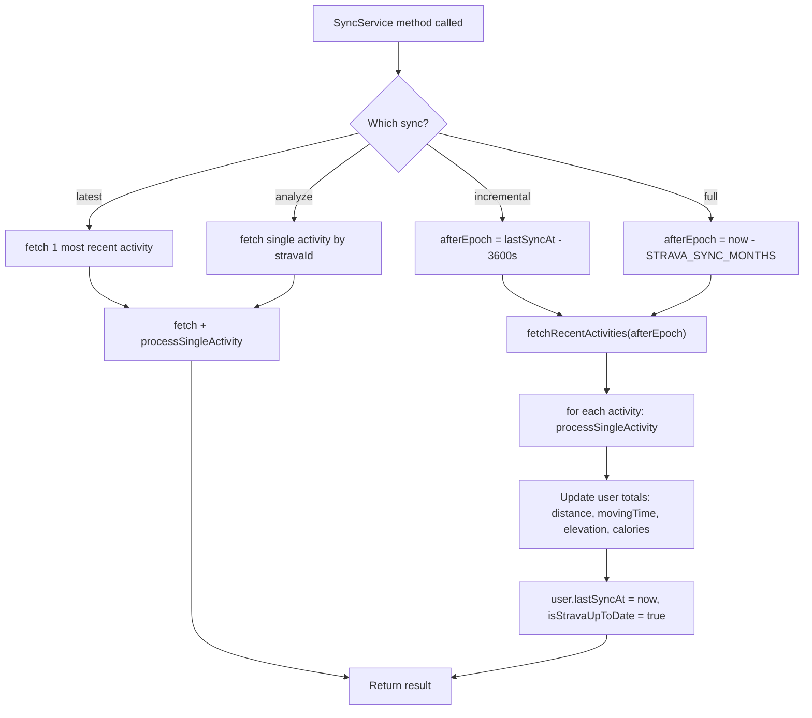
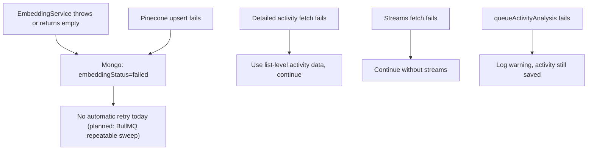

# Strava Sync & Data Pipeline Flow

> Sources: `backend/src/sync/`, `backend/src/analysis/activity-sync-pipeline.service.ts`, `backend/src/analysis/data-processor.service.ts`

How Strava activities are fetched, stored in MongoDB, processed, embedded, and upserted into Pinecone. Today this runs **synchronously in the HTTP request path** (or fire-and-forget after login), not via the BullMQ `sync` queue.

---

## 1. Sync Triggers

| Endpoint | Method | Behavior |
| --- | --- | --- |
| `POST /sync/incremental` | `incrementalSync` | Fetch activities since `user.lastSyncAt - 1h` |
| `POST /sync/full` | `fullSync` | Fetch all activities within `STRAVA_SYNC_MONTHS` window |
| `POST /sync/latest` | `syncLatest` | Fetch and process the single most recent activity |
| `POST /sync/analyze/:stravaId` | Re-process one activity by Strava ID |

Key files: `sync.controller.ts`, `sync.service.ts`, `auth.controller.ts` (login hook).

---

## 2. End-to-End Pipeline (Single Activity)

---

## 3. Sequence Diagram (Detailed)

---

## 4. Data Processing Detail

---

## 5. Incremental vs Full Sync

---

## 6. Failure Handling

---

## Key Files

| File | Role |
| --- | --- |
| `backend/src/sync/sync.controller.ts` | HTTP endpoints |
| `backend/src/sync/sync.service.ts` | Strava fetch, `processSingleActivity`, sync orchestration |
| `backend/src/analysis/activity-sync-pipeline.service.ts` | Embed + Pinecone upsert |
| `backend/src/analysis/data-processor.service.ts` | Metrics + session classification |
| `backend/src/analysis/summary-builder.service.ts` | Text for embedding |
| `backend/src/analysis/embedding.service.ts` | Gemini embedding API |
| `backend/src/analysis/pinecone-client.ts` | Vector upsert/query/delete |
| `backend/src/analysis/analysis.service.ts` | `queueActivityAnalysis` → LLM analysis job |
