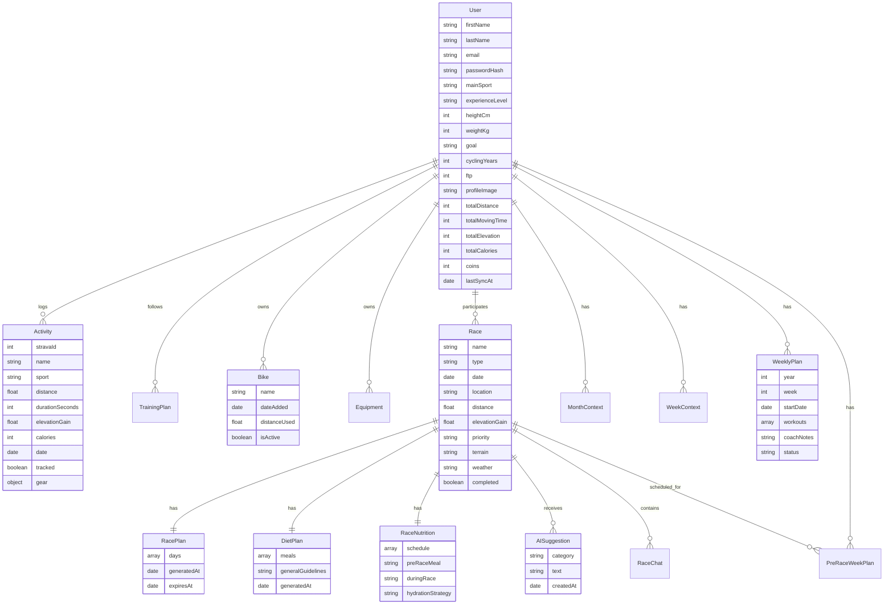

# Database Schema

This diagram represents the Mongoose-based database schema for the Cycling Coach application.

```mermaid
erDiagram
    User ||--o{ Activity : logs
    User ||--o{ TrainingPlan : follows
    User ||--o{ Bike : owns
    User ||--o{ Equipment : owns
    User ||--o{ Race : participates
    User ||--o{ MonthContext : has
    User ||--o{ WeekContext : has
    User ||--o{ WeeklyPlan : has
    User ||--o{ PreRaceWeekPlan : has

    Race ||--|| RacePlan : has
    Race ||--|| DietPlan : has
    Race ||--|| RaceNutrition : has
    Race ||--o{ AISuggestion : receives
    Race ||--o{ RaceChat : contains
    Race ||--o{ PreRaceWeekPlan : scheduled_for

    User {
        string firstName
        string lastName
        string email
        string passwordHash
        string mainSport
        string experienceLevel
        int heightCm
        int weightKg
        string goal
        int cyclingYears
        int ftp
        string profileImage
        int totalDistance
        int totalMovingTime
        int totalElevation
        int totalCalories
        int coins
        date lastSyncAt
    }

    Activity {
        int stravaId
        string name
        string sport
        float distance
        int durationSeconds
        float elevationGain
        int calories
        date date
        boolean tracked
        object gear
    }

    Race {
        string name
        string type
        date date
        string location
        float distance
        float elevationGain
        string priority
        string terrain
        string weather
        boolean completed
    }

    Bike {
        string name
        date dateAdded
        float distanceUsed
        boolean isActive
    }

    WeeklyPlan {
        int year
        int week
        date startDate
        array workouts
        string coachNotes
        string status
    }

    RacePlan {
        array days
        date generatedAt
        date expiresAt
    }

    DietPlan {
        array meals
        string generalGuidelines
        date generatedAt
    }

    RaceNutrition {
        array schedule
        string preRaceMeal
        string duringRace
        string hydrationStrategy
    }

    AISuggestion {
        string category
        string text
        date createdAt
    }
```
